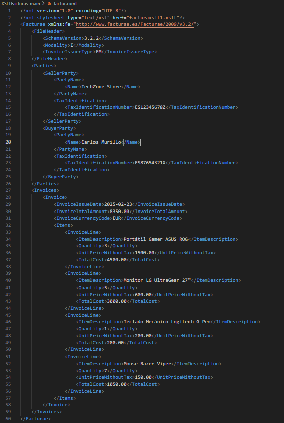
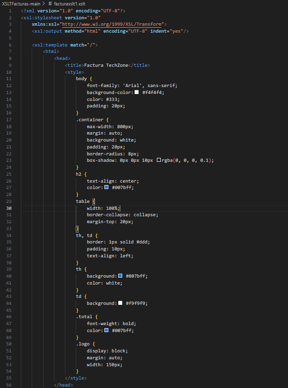
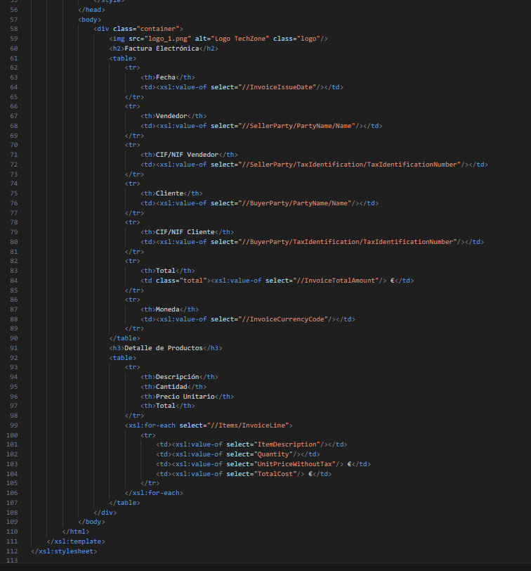
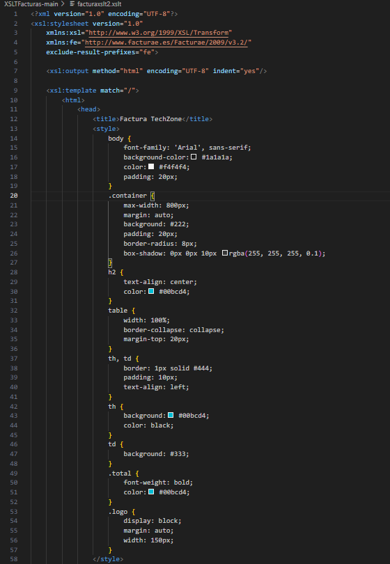
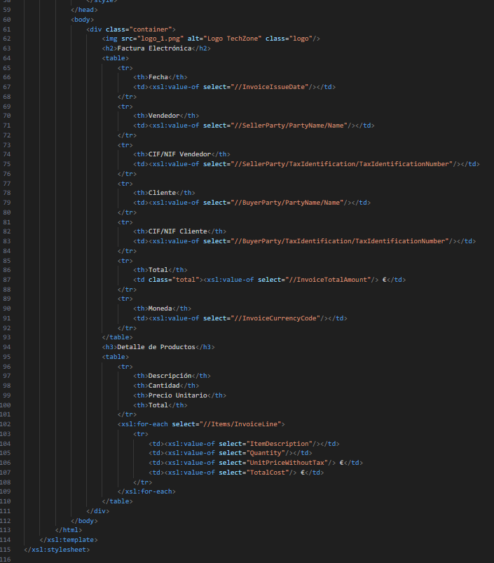

## Conversión de Facturas XML a HTML con XSLT

Este repositorio contiene dos estilos XSLT creados para transformar archivos XML de facturación en páginas HTML con una presentación atractiva y estructurada.

### Archivos incluidos

- **facturaxslt1.xslt**: Estilo con una apariencia limpia y profesional.
- **facturaxslt2.xslt**: Diseño oscuro con un enfoque más moderno.
- **factura.xml**: Documento de muestra con información de una factura.
- **factura1.html**: Salida HTML generada con `facturaxslt1.xslt`.
- **factura2.html**: Resultado visual al aplicar `facturaxslt2.xslt`.

### Características de los estilos

#### facturaxslt1.xslt

- Diseño minimalista con colores claros.
- Tipografía sencilla y estructura ordenada.
- Tablas con bordes definidos para facilitar la lectura.
- Presentación adecuada para entornos corporativos.

#### facturaxslt2.xslt

- Apariencia oscura con detalles resaltados en azul.
- Mayor contraste para mejorar la visibilidad.
- Distribución moderna y llamativa.
- Ideal para interfaces avanzadas.

### Instrucciones de uso

1. Usa un navegador compatible con XSLT o una herramienta adecuada.
2. Enlaza la plantilla deseada en `factura.xml` agregando:

```xml
<?xml-stylesheet type="text/xsl" href="facturaxslt1.xslt"?>
```

o bien:

```xml
<?xml-stylesheet type="text/xsl" href="facturaxslt2.xslt"?>
```

3. Abre `factura.xml` en un navegador para ver el formato aplicado.

### Ejemplo de salida visual

A continuación, se muestran capturas de pantalla del resultado obtenido:

- `facturaxslt1.xslt`:  , 
- `facturaxslt2.xslt`: , , 

### Contribuciones

Si deseas aportar mejoras o modificaciones, puedes hacer un fork del repositorio y enviar tus cambios a través de un pull request.

